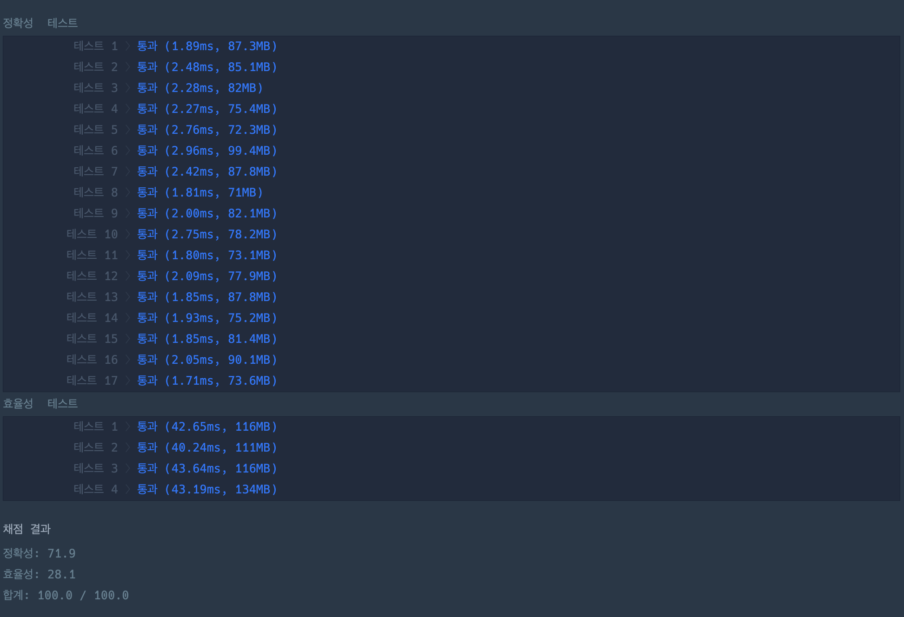

### 📌 문제 링크

---

- 프로그래머스 [같은 숫자는 싫어](https://school.programmers.co.kr/learn/courses/30/lessons/12906)

### 📍 문제 접근

---

- 연속적으로 숫자를 제거하기 위해서 앞서 추가된 원소와 현재 추가할 원소를 비교
- 마지막으로 추가된 원소에 바로 접근할 수 있다면 arr 배열 크기만큼 반복
- 마지막 원소를 접근하기 위해서 이미 추가된 배열을 순차적으로 접근한다면 이론상 (1 + 1,000,000) _ (1,000,000 / 2) _ 1,000,000 -> 마지막 원소에 바로 접근할 수 있어야하는 이유

### ⏳ 수행 시간

---

- 30분(자바 문법 이슈,,,ㅎ)

### ✅ 테스트 인증

---



### ⏰ 시간 복잡도

---

- O(N)

### 🧑‍💻 코드

---

```java
import java.util.*;

public class Solution {
    public int[] solution(int []arr) {
        List<Integer> answer = new ArrayList();


        for (int i = 0; i < arr.length; i++) {
            if (answer.size() == 0) {
                answer.add(arr[i]);
            } else {
                int last = answer.get(answer.size() - 1);
                if (last != arr[i]) {
                    answer.add(arr[i]);
                }
            }
        }

        return answer.stream().mapToInt(i -> i).toArray();
    }
}
```
